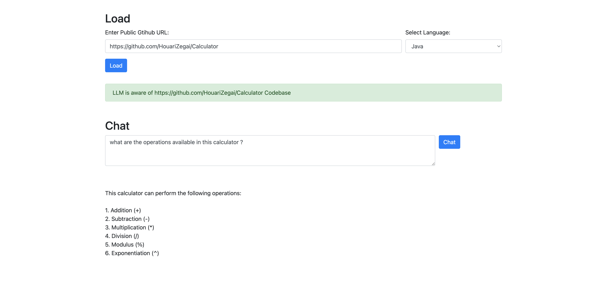

# Code Doc Generator

Generate response from LLM with a given codbase context. Currently this supports for JAVA and PYTHON

## Build

1. Using Docker

```shell
docker pull aswanthpp/code_doc_gen_llm:v1.0.0
docker run -p 5050:5050 -e OPENAI_API_KEY="<YOUR_OPEN_AI_KEY>" aswanthpp/code_doc_gen_llm:v1.0.0
```

2. Using Flask
```shell
pip install -r requirements.txt
export OPENAI_API_KEY="<YOUR_OPEN_AI_KEY>"
python -u app.py                          
```

NB:  Replace <YOUR_OPEN_AI_KEY> with your open api key while running the docker.


## Usage

Once the Application is build using any of the above steps. Web page will be available at http://localhost:5050/. 



The below are the features available in this utility.

### 1. Load codebase to LLM

Provide a public github repo url, select the programming language from the dropdown and hit load.

NB: This is a one time activity for a given codebase, only re-load if you want load another codebase or change language

### 2. Generate response from LLM 

Generate LLM response using the information from Custom codebase loaded earlier<br>

Enter your Query in the Text are and hit Chat, wait for the response from LLM

