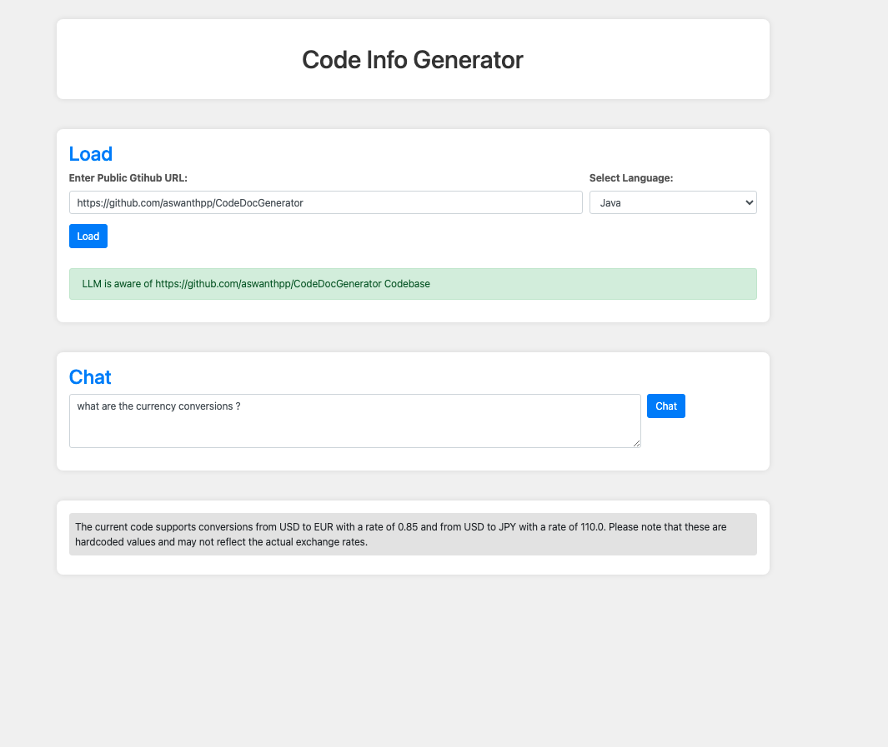

# Code Doc Generator

The Code Doc Generator is a utility that leverages a Language Model (LLM) to generate responses based on a given codebase context. It currently supports Java and Python programming languages. The tool allows you to interactively query the model and receive informative responses about the code.

## Build

1. Using Docker

```shell
docker pull aswanthpp/code_doc_gen_llm:v1.0.0
docker run -p 5050:5050 -e OPENAI_API_KEY="<YOUR_OPEN_AI_KEY>" aswanthpp/code_doc_gen_llm:v1.0.0
```

2. Using Flask
```shell
pip install -r requirements.txt
export OPENAI_API_KEY="<YOUR_OPEN_AI_KEY>"
python -u app.py                          
```

<b>Note</b>:  Replace <YOUR_OPEN_AI_KEY> with your OpenAI API key when running the Docker container or Flask application.


## Usage

Once the application is built using either of the methods above, the web page will be available at http://localhost:5050/.



The utility offers the following features:


### 1. Load codebase to LLM

Provide a public GitHub repo URL, select the programming language from the dropdown, and click "Load." This is a one-time activity for a given codebase. Only reload if you want to load another codebase or change the language.


### 2. Generate response from LLM 

Generate LLM responses using the information from the custom codebase loaded earlier. Enter your query in the text area and click "Chat." Wait for the response from LLM.


